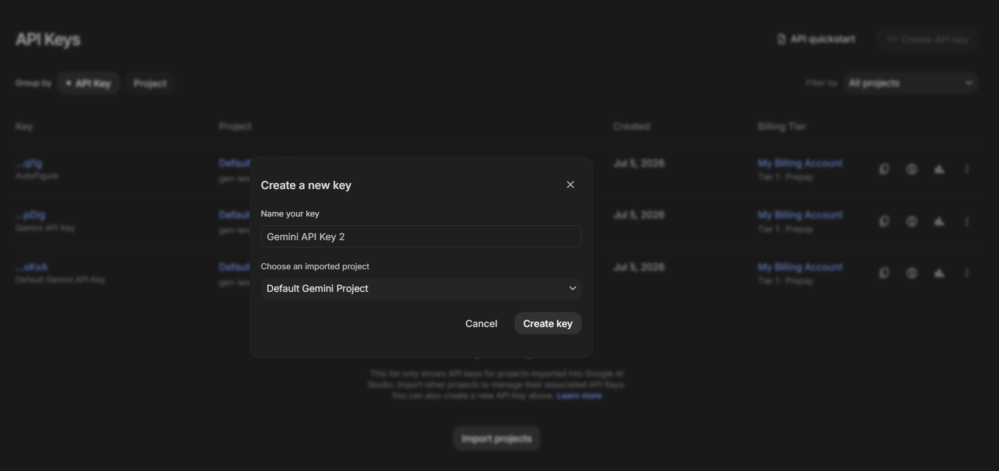
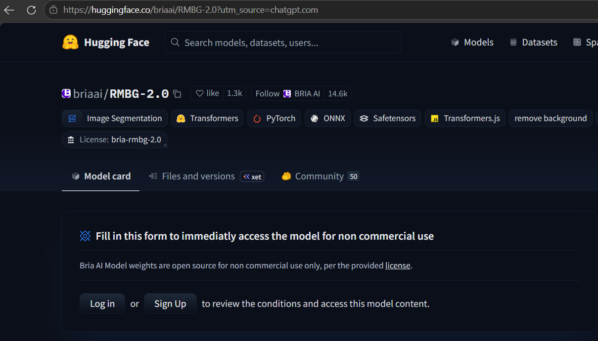
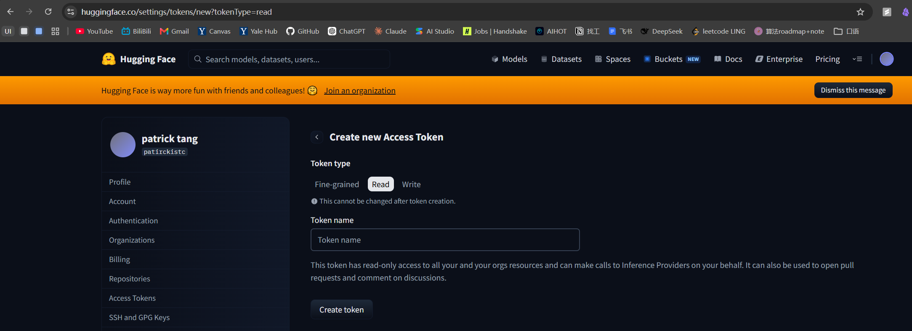
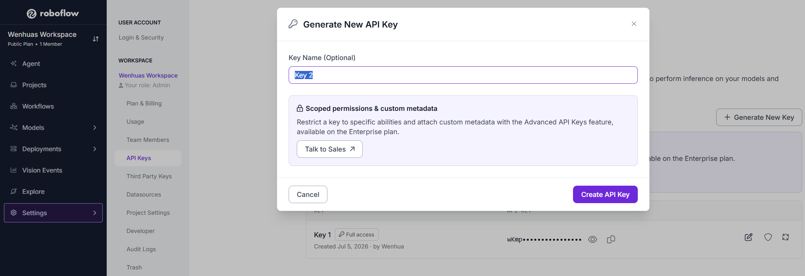
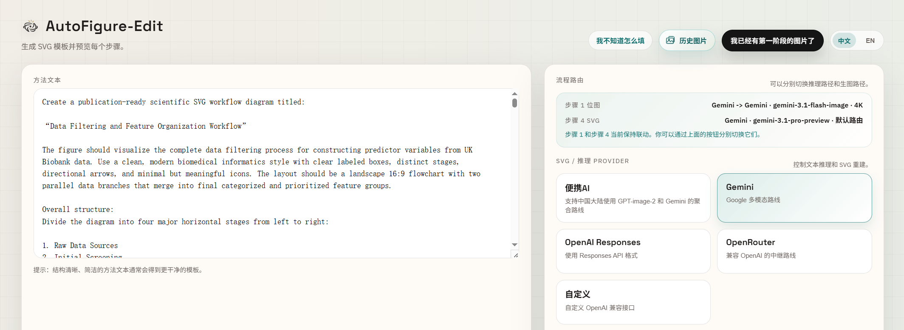

# AutoFigure-Edit 配置教学手册

适用项目：https://github.com/ResearAI/AutoFigure-Edit

本文档按当前本地默认配置编写：Gemini 负责生图和 SVG 重建，Roboflow 负责 SAM 分割，Hugging Face 负责 RMBG-2.0 去背景。

## 1. 安装 Docker Desktop

AutoFigure-Edit 依赖 Python、深度学习库和图像处理库。推荐使用 Docker 部署，避免本机 Python 版本和依赖冲突。

Docker Desktop：
https://www.docker.com/products/docker-desktop/

安装后打开 Docker Desktop，等待 Docker Engine 正常运行。

## 2. 获取项目

在codex / cluade code里输入：
```
根据https://github.com/ResearAI/AutoFigure-Edit，
按照这个gitHub repo的README帮我配置下
```

## 3. 进入Vscode/Cursor等本地IDE，编辑 `.env`文件

当前推荐的最小配置只需要三类 key/token：

```env
GEMINI_API_KEY=你的_Google_AI_Studio_Gemini_API_key
HF_TOKEN=你的_HuggingFace_Read_token
ROBOFLOW_API_KEY=你的_Roboflow_Private_API_key
```

说明：

- `GEMINI_API_KEY`：用于 Gemini 生图和 SVG 重建。
- `HF_TOKEN`：用于下载 gated 模型 `briaai/RMBG-2.0` 做去背景。
- `ROBOFLOW_API_KEY`：用于 Web/Docker 默认 SAM3 图像分割的后端。


## 4. API Key 获取

### 4.1 Google Gemini API key

用途：

```env
GEMINI_API_KEY=...
```

获取步骤：

1. 打开 Google AI Studio。
2. 进入 API Keys 页面。
3. 创建 Gemini API key。
4. 可选：限制 key 只用于 Gemini API。
5. 复制到 `.env` 的 `GEMINI_API_KEY=` 后面。

官方文档：

https://ai.google.dev/gemini-api/docs/api-key

截图参考：



### 4.2 Hugging Face token

用途：

```env
HF_TOKEN=...
```

本项目使用 `briaai/RMBG-2.0` 做图标去背景。该模型是 gated 模型，需要先申请/接受访问权限。

获取步骤：

1. 登录 Hugging Face。
2. 访问 `briaai/RMBG-2.0` 模型页面并接受访问要求。
3. 打开 Settings 里的 Access Tokens。
4. 创建一个 Read token。
5. 复制到 `.env` 的 `HF_TOKEN=` 后面。

官方文档：

https://huggingface.co/briaai/RMBG-2.0?utm_source=chatgpt.com

https://huggingface.co/docs/hub/en/security-tokens

截图参考：





### 4.3 Roboflow API key

用途：

```env
ROBOFLOW_API_KEY=...
```

获取步骤：

1. 打开 Roboflow workspace： https://universe.roboflow.com/agenttrain/agent
2. 先 sign up / 登录。
3. 打开 workspace 的 Settings。
4. 进入 API Keys 页面。
5. 找到或生成 Private API Key。
6. 复制到 `.env` 的 `ROBOFLOW_API_KEY=` 后面。

官方文档：

https://docs.roboflow.com/developer/authentication/find-your-roboflow-api-key

截图参考：



## 5. 检查 `.env` 是否包含以下key

保留下面这些即可：

```env
ROBOFLOW_API_KEY=你的_roboflow_private_key
GEMINI_API_KEY=你的_gemini_api_key
HF_TOKEN=你的_huggingface_read_token
```

不使用的 provider 相关配置可以不填，也不需要在手册流程里关注。

## 6. 启动服务

完整 Docker 启动流程参考：

- [Docker 启动指南](docs/startup-guide.md)

如果codex / claude code已经为你开启了服务器，则打开 Web 页面，复制粘贴以下URL
http://localhost:8000

推荐页面配置(见页面右边选项)：

```text
Provider: Gemini
Step 1 Image Provider: Same as SVG path / Gemini
Image Model: gemini-3.1-flash-image
Image Size: 4K
Auto Upscale: On
SVG Model: gemini-3.1-pro-preview
SAM Backend: roboflow
```

下方API key 输入框可以留空，后端会读取 `.env`。

## 7. 方法文本改写 Prompt 参考

将论文method部分先用下面这个提示词优化，让 Codex / ChatGPT / Claude 把method段落改写成更适合 AutoFigure-Edit 生成图的输入文本：

- [manual_prompt.txt](manual_prompt.txt)

使用方式：

1. 打开 `manual_prompt.txt`。
2. 把里面的 `[method txt]` 替换成你的论文方法文本。
3. 让模型输出一份“可复制使用的文本”。
4. 将输出结果粘贴到 AutoFigure-Edit 页面左侧输入框，再点击生成。记得确认SVG / 推理 Provider选的是Gemini

## 8. 查看输出目录和历史图片

输出目录位于：

```text
AutoFigure-Edit\outputs
```

当前任务目录命名规则：

```text
output_YYYY-MM-DD_HH-MM
```

如果同一分钟内提交多个任务，会自动追加序号。

每个任务目录通常包含：

```text
run.log
figure.png
samed.png
boxlib.json
icons/
template.svg
optimized_template.svg
final.svg
```

如果任务失败，优先查看, 将Log复制给codex / claude code诊断

```text
outputs\<任务目录>\run.log
```

## 9. 故障排除

### 9.1 补填 API key 后仍然报 missing key

如果页面或日志提示缺少某个 API key，先检查 `.env` 是否已经补上对应变量，例如：

```env
GEMINI_API_KEY=...
OPENAI_API_KEY=...
ROBOFLOW_API_KEY=...
HF_TOKEN=...
```

补完 `.env` 后，需要让 Docker 重新创建容器，才能重新读取新的环境变量。不要只用 `docker compose restart`。

推荐命令：

```bash
docker compose up -d --force-recreate
```

如果你同时改了 `Dockerfile` 或依赖，再使用：

```bash
docker compose up -d --build --force-recreate
```

### 9.2 macOS 看不见 `.env` 文件

macOS Finder 默认会隐藏以 `.` 开头的文件。如果在项目目录里看不见 `.env`，按：

```text
Command + Shift + .
```

即可显示或隐藏这类文件。
